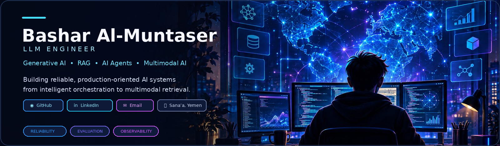
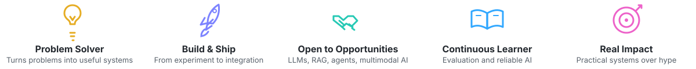

**LLM ENGINEER** · Generative AI · RAG · AI Agents · Multimodal AI

  &nbsp;
  &nbsp;
  &nbsp;
  &nbsp;
  &nbsp;
  

<table>
  <tr>
    <td width="68%" valign="top">
      <h2 id="about-me">◉ About Me</h2>
      
I’m an <strong>LLM Engineer</strong> focused on designing reliable generative-AI systems, multi-model orchestration, retrieval-augmented generation, agentic systems, evaluation, observability, and production deployment. I enjoy building AI systems that solve real problems, with a strong interest in Arabic NLP, multimodal AI, structured generation, and AI infrastructure.

      

        
      

    </td>
    <td width="32%" valign="top">
      <h2>◈ Snapshot</h2>
      
<strong>🎓 B.Sc. Artificial Intelligence</strong> 
      Emirates International University 2022 – 2026

      

      
<strong>💼 AI Engineer Intern — Sofa</strong> 
      Aug 2026 – Present

      Multi-model routing · evaluation AI security · memory architectures production integration
    </td>
  </tr>
</table>

<h2>⚙️ Technical Stack Core technologies I work with</h2>

  
  
  
  
  
  
  
  
  
  
  
  
  
  
  

<h2 id="featured-projects">▰ Featured Projects <a href="https://github.com/BXR7?tab=repositories">View all repositories →</a></h2>

<table>
  <tr>
    <td width="33%" valign="top">
      <h3> <a href="https://github.com/BXR7/spatio-temporal-video-rag">Spatio-Temporal Multimodal Video RAG</a></h3>
      
End-to-end multimodal video moment retrieval across vision, speech, OCR, space, and time.

      Whisper · Qwen2.5-VL · BGE-M3 · Qdrant · FastAPI  
      <a href="https://github.com/BXR7/spatio-temporal-video-rag">View repository →</a>
    </td>
    <td width="33%" valign="top">
      <h3> <a href="https://github.com/BXR7/AI-Discovery-Monitor-GEO-Platform">GEO Platform</a></h3>
      
Multi-model AI discovery and visibility monitoring with citations and share of voice.

      OpenAI · Claude · Gemini · LangChain · PostgreSQL · Redis  
      <a href="https://github.com/BXR7/AI-Discovery-Monitor-GEO-Platform">View repository →</a>
    </td>
    <td width="33%" valign="top">
      <h3> Smart Amazon Product Analyzer</h3>
      
ML-powered product intelligence combining forecasting, NLP, competitive analysis, and finance.

      SAPA · Private project · Repository not public  
      <strong>Private repository</strong>
    </td>
  </tr>
  <tr>
    <td width="33%" valign="top">
      <h3> <a href="https://github.com/BXR7/ai-risk-assessment-gateway">AI Risk Assessment Gateway</a></h3>
      
Semantic risk classification and policy-based routing for AI requests.

      Python · FastAPI · AI Security  
      <a href="https://github.com/BXR7/ai-risk-assessment-gateway">View repository →</a>
    </td>
    <td width="33%" valign="top">
      <h3> <a href="https://github.com/BXR7/SawtShield">SawtShield</a></h3>
      
Speech-only audio deepfake detection with an AASIST-inspired architecture.

      AASIST · PyTorch · Audio ML · FastAPI  
      <a href="https://github.com/BXR7/SawtShield">View repository →</a>
    </td>
    <td width="33%" valign="top">
      <h3> <a href="https://github.com/BXR7/Fake-Review-Detection">Fake Review Detection</a></h3>
      
RoBERTa-based fake-review detection with domain-adversarial training and linguistic features.

      Transformers · RoBERTa · NLP · FastAPI  
      <a href="https://github.com/BXR7/Fake-Review-Detection">View repository →</a>
    </td>
  </tr>
</table>

<table>
  <tr>
    <td width="67%" valign="top">
      <h2 id="experience">▣ Experience</h2>
      <h3>AI Engineer Intern — Sofa</h3>
      <strong>Aug 2026 – Present</strong>
      <ul>
        <li>Intelligent request classification and dynamic LLM selection</li>
        <li>Multi-model routing with LiteLLM</li>
        <li>Model evaluation across quality, latency, reliability, and cost</li>
        <li>AI gateway security and benchmarking</li>
        <li>Memory architecture evaluation</li>
        <li>Production-oriented integration with Python, REST APIs, and Docker</li>
      </ul>
    </td>
    <td width="33%" valign="top">
      <h2 id="certifications">✦ Certifications</h2>
      
 <strong>Claude 101</strong> Anthropic · Jun 2026

      
 <strong>Introduction to Agent Skills</strong> Anthropic · Jul 2026

      
 <strong>Introduction to Generative AI</strong> Google · Jun 2026

    </td>
  </tr>
</table>

<h2 id="connect">➤ Let’s Connect</h2>

I’m interested in opportunities involving LLM systems, RAG, AI agents, multimodal applications, evaluation, and production AI infrastructure.

  &nbsp;
  &nbsp;
  

> “Building AI systems that are not only intelligent — but observable, testable, and reliable.”

