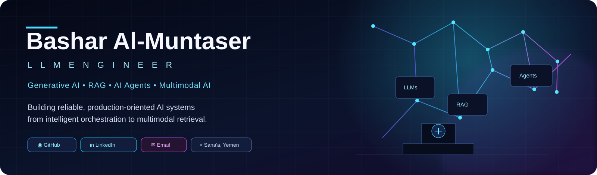
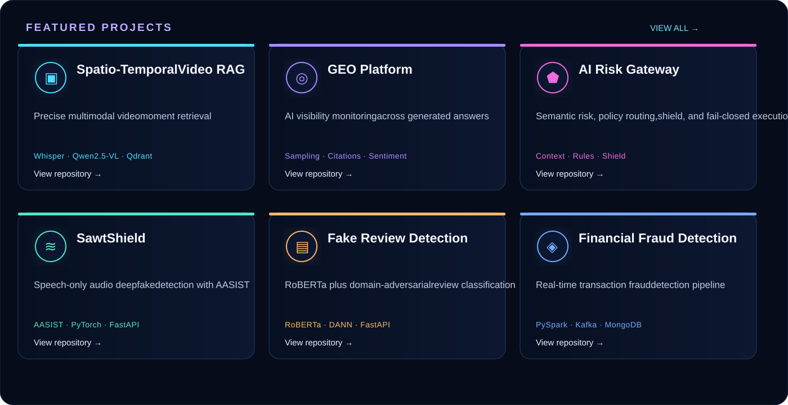

[GitHub](https://github.com/Bashar-1216) · [LinkedIn](https://linkedin.com/in/bashar-almuntaser) · [Email](mailto:almuntaserbashar@gmail.com)

## Specialization

**Multi-model LLM orchestration** · **RAG** · **Structured generation** · **AI agents** · **LLM evaluation** · **Observability** · **Production reliability** · **Arabic NLP** · **Multimodal retrieval**

## About

I’m an **LLM Engineer** focused on building reliable generative-AI systems: from orchestration and retrieval to evaluation, observability, and production integration. My work explores how AI systems can become more useful, testable, and dependable across text, audio, image, and video.

Based in **Sana'a, Yemen**.

## Snapshot

> **AI Engineer Intern — Sofa**
> `Aug 2026 – Present` · Multi-model routing · evaluation · AI security · memory architectures · production integration
>
> **B.Sc. Artificial Intelligence**
> Emirates International University · `2022 – 2026`

## Technical Stack

 

| Build | Retrieve & observe | Model layer |
|:---|:---|:---|
| Python · TypeScript · FastAPI · React · Next.js · Docker | Qdrant · pgvector · Elasticsearch · Redis · Langfuse | OpenAI · Claude · Gemini · LLaMA · Ollama · LangChain |

## Featured Projects

The visual grid follows the reference layout. Repository links are listed separately so navigation remains reliable on GitHub and on mobile.

| Project | Repository |
|:---|:---|
| Spatio-Temporal Multimodal Video RAG | [Open repository →](https://github.com/Bashar-1216/spatio-temporal-video-rag) |
| AI Discovery Monitor / GEO Platform | [Open repository →](https://github.com/Bashar-1216/AI-Discovery-Monitor-GEO-Platform) |
| AI Risk Assessment Gateway | [Open repository →](https://github.com/Bashar-1216/Classifiers-) |
| SawtShield | [Open repository →](https://github.com/Bashar-1216/SawtShield) |
| Fake Review Detection | [Open repository →](https://github.com/Bashar-1216/Fake-Review-Detection) |
| Financial Fraud Detection | [Open repository →](https://github.com/Bashar-1216/Financial-Fraud-Detection) |

[Explore all public repositories →](https://github.com/Bashar-1216?tab=repositories)

## Experience

### AI Engineer Intern — Sofa

`Aug 2026 – Present`

- Intelligent request classification and dynamic LLM selection
- Multi-model routing with LiteLLM
- Model evaluation across quality, latency, reliability, and cost
- AI gateway security and benchmarking
- Reproducible evaluation datasets and experimental pipelines
- Memory architecture evaluation across PostgreSQL/pgvector, Mem0, and SurrealDB
- Production integration with Python, REST APIs, Docker, and LLM services

**Selected private work:** Smart Amazon Product Analyzer (SAPA) — kept private; no public repository link is provided.

## Education & Certifications

**B.Sc. Artificial Intelligence**
Emirates International University · `2022 – 2026`

- **Claude 101** — Anthropic
- **Introduction to Agent Skills** — Anthropic
- **Introduction to Generative AI** — Google

## Connect

If you’re working on **LLM systems, RAG, AI agents, multimodal applications, evaluation, or production AI infrastructure**, I’d be glad to connect.

[LinkedIn](https://linkedin.com/in/bashar-almuntaser) · [Email](mailto:almuntaserbashar@gmail.com) · [GitHub](https://github.com/Bashar-1216)

