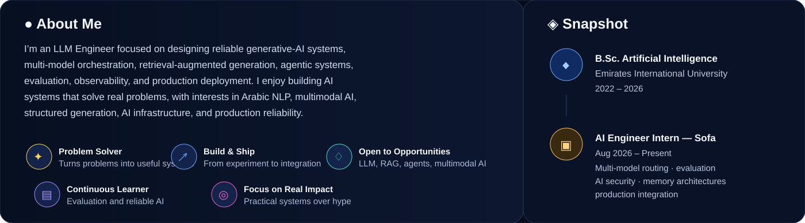
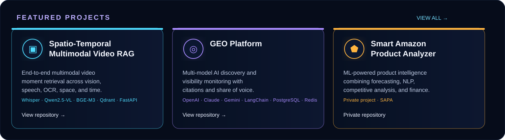
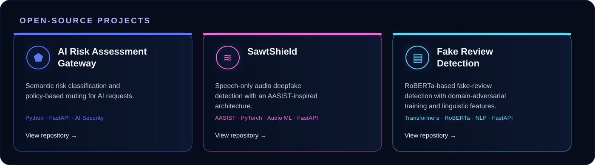
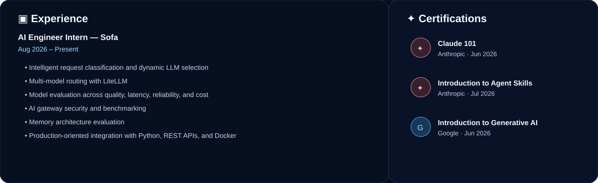
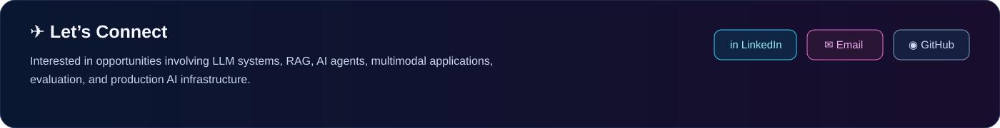

## ⚙️ Tech Stack

## 🗂️ Featured Projects

[Spatio-Temporal Video RAG →](https://github.com/Bashar-1216/spatio-temporal-video-rag) · [GEO Platform →](https://github.com/Bashar-1216/AI-Discovery-Monitor-GEO-Platform) · **SAPA — Private Project**

[AI Risk Assessment Gateway →](https://github.com/Bashar-1216/ai-risk-assessment-gateway) · [SawtShield →](https://github.com/Bashar-1216/SawtShield) · [Fake Review Detection →](https://github.com/Bashar-1216/Fake-Review-Detection)

## 💼 Experience & Certifications

## ✈️ Connect

[LinkedIn](https://linkedin.com/in/bashar-almuntaser) · [Email](mailto:almuntaserbashar@gmail.com) · [GitHub](https://github.com/Bashar-1216)

> “Building AI systems that are not only intelligent — but observable, testable, and reliable.”

